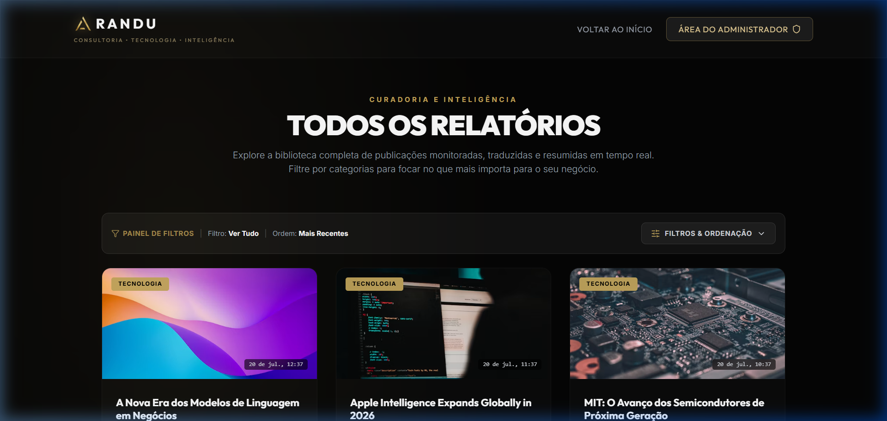
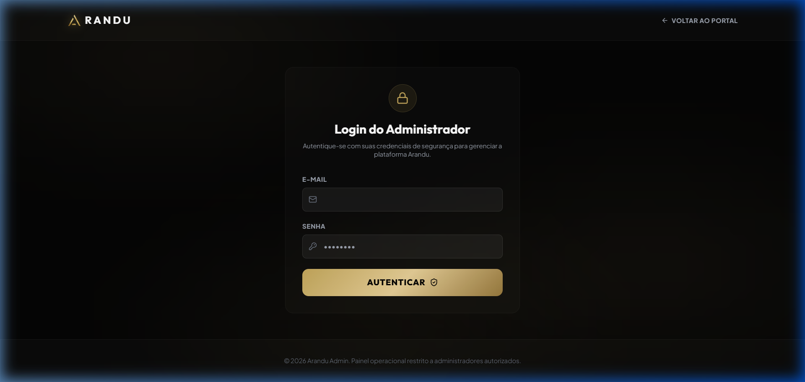
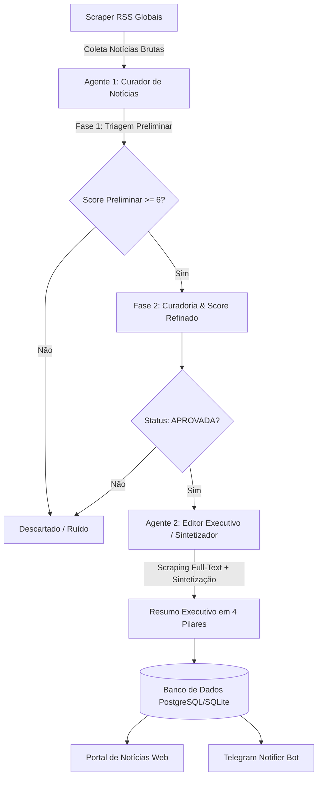

# Arandu - Portal de Inteligência, Notícias & Curadoria Estratégica

<div align="center">
  
  <h3>Consultoria • Tecnologia • Inteligência</h3>
</div>

Arandu é um portal premium de curadoria e inteligência de mercado voltado para tomadores de decisão em tecnologia, empreendedorismo e investimentos. Ele une um design moderno, de alto impacto visual (*dark mode* com acentos em dourado metálico e glassmorphism), a um poderoso ecossistema de automação multi-agente no backend para captação de leads, web scraping de notícias globais, triagem de relevância por IA, resumos executivos e alertas automatizados via Telegram.

---

## 📸 Screenshots & Demonstração Visual

### 1. Landing Page Pública (`index.html`)
Página inicial institucional focada em captura de leads qualificados para a comunidade estratégica.


### 2. Portal de Notícias & Resumos Executivos (`noticias.html`)
Feed interativo de relatórios qualificados pelos agentes de IA com ordenação por categorias e fontes globais.


### 3. Painel Administrativo Operacional (`admin.html`)
Painel de controle com monitoramento em tempo real do pipeline de IA, gestão de leads e acionamento manual de coleta.


---

## 🤖 Arquitetura de Agentes Autônomos de IA (Multi-Agent System)

O Arandu utiliza um pipeline autônomo desacoplado em **2 Agentes Especializados** alimentados pelo Gemini com schemas Pydantic estritos para garantir respostas estruturadas e determinísticas:



### 🔹 Agente 1: Curador de Notícias (`agent/Curador de Notícias`)
- **Responsabilidade**: Atua como o primeiro filtro de qualidade e relevância, eliminando sensacionalismo, clickbaits e notícias de baixo impacto.
- **Operação em 2 Fases**:
  1. **Triagem Preliminar**: Avaliação rápida de lote bruto com pontuação de 0 a 10.
  2. **Qualificação Profunda**: Atribuição de score refinado (0-100), categoria temática (`Tecnologia`, `IA/Automação`, `Mercado/Investimentos`, etc.), nível de prioridade e justificativa analítica em até 15 palavras.
- **Exemplo de JSON Output do Agente Curador**:
```json
{
  "items": [
    {
      "id": 142,
      "status": "APROVADA",
      "justificativa": "Apresenta avanços em LLMs para geração de código com impacto direto em produtividade de software.",
      "categoria_identificada": "IA/Automação",
      "score": 5
    }
  ]
}
```

### 🔹 Agente 2: Sintetizador / Editor Executivo (`agent/Editor Executivo`)
- **Responsabilidade**: Atua como editor-chefe técnico. Realiza a leitura integral do artigo original via web scraping e gera um relatório pronto para consumo executivo.
- **Entregáveis do Agente**:
  - **Título Otimizado**: Reescrita jornalística direta e sem sensacionalismo.
  - **Resumo Executivo em 4 Pilares**: `O que aconteceu?`, `Por que isso importa?`, `Possíveis impactos` e `3 a 5 Pontos-chave`.
  - **Métricas Editoriais**: Pontuação calculada pela IA para Clareza (`clarity_score`), Impacto (`impact_score`) e Inovação (`innovation_score`).
  - **SEO & Categoria**: Meta descrição (< 160 caracteres) e tags otimizadas para busca.
- **Exemplo de JSON Output do Agente Sintetizador (Editor Executivo)**:
```json
{
  "headline": "Novo Modelo de IA Otimiza Compilação de Código C++ em Tempo Real",
  "summary": {
    "what_happened": "Pesquisadores anunciaram um novo modelo estatístico treinado para otimizar compilações em pipelines de CI/CD.",
    "why_it_matters": "Reduz o tempo de build em projetos de grande escala em até 40%, diminuindo custos computacionais de nuvem.",
    "possible_impacts": "Equipes de DevOps e infraestrutura acelerarão entregas contínuas e reduzirão pegada de carbono de data centers.",
    "key_points": [
      "Redução de 40% no tempo total de compilação",
      "Compatibilidade direta com compiladores LLVM e GCC",
      "Implementação transparente em esteiras de integração contínua sem refatoração"
    ]
  },
  "category": "IA/Automação",
  "tags": ["Inteligência Artificial", "DevOps", "Engenharia de Software", "LLVM", "Produtividade"],
  "meta_description": "Novo modelo de inteligência artificial otimiza compilações C++ e reduz o tempo de build de software em até 40%.",
  "scores": {
    "clarity_score": 96,
    "impact_score": 90,
    "innovation_score": 94
  }
}
```

---

## 🎨 Identidade Visual & Branding

- **Design Premium**: Visual dark mode sofisticado com glassmorphism, acentos em dourado metálico (`#C5A85C`) e tipografia modernista (*Outfit* e *Inter*).
- **Logotipo Dourado**: Emblema estilizado da letra **"A"** em dourado metálico recortado com transparência alpha (`scripts/arandu_emblem_transparent.png`).
- **Slogan Oficial**: `"Consultoria • Tecnologia • Inteligência"`.

---

## 📂 Arquitetura do Projeto

```text
Arandu/
├── agent/                  # Sistema Multi-Agente de IA (Gemini API)
│   ├── Curador de Notícias/# Agente 1: Filtro de Relevância & Classificação 2 Fases
│   └── Editor Executivo/   # Agente 2: Web Scraper Full-Text & Sintetizador Executivo
├── api/
│   └── index.py            # Entrypoint Vercel Serverless (WSGI/ASGI wrapper)
├── artifacts/              # Imagens e demonstrativos visuais do projeto
├── core/
│   ├── notifier.py         # Notificador automatizado via Telegram Bot
│   ├── processor.py        # Integração Gemini e processamento de linguagem natural
│   ├── status.py           # Monitorador do pipeline operacional de IA
│   └── scraper.py          # Scraper de fontes RSS globais (TechCrunch, MIT Review, G1, etc)
├── database/
│   ├── config.py           # Configurações e variáveis de ambiente
│   ├── connection.py       # Engine SQLAlchemy e escopo de sessões
│   └── models.py           # Modelos ORM (Lead, News, Source, User, ActiveSession)
├── scripts/
│   ├── arandu_emblem_transparent.png # Logo/Emblema oficial recortado sem fundo
│   ├── crop_emblem.py      # Script de tratamento cirúrgico de transparência do emblema
│   └── init_db.py          # Carga inicial do banco de dados e usuários padrão
├── admin.html              # Dashboard administrativo e monitor da API
├── index.html              # Landing Page pública com modal de captura de leads
├── noticias.html           # Feed público de relatórios executivos por nicho
├── main.py                 # Servidor backend principal FastAPI + APScheduler
├── requirements.txt        # Dependências do Python
└── vercel.json             # Configuração de deploy serverless na Vercel
```

---

## 🚀 Instalação e Configuração

### 1. Pré-requisitos
Python 3.10+ instalado no sistema.

### 2. Instalação das Dependências
```bash
pip install -r requirements.txt
```

### 3. Configuração do Arquivo `.env`
Crie o arquivo `.env` na raiz do projeto conforme o exemplo abaixo:
```ini
DATABASE_URL=sqlite:///arandu.db
GEMINI_API_KEY=sua-chave-gemini-aqui
TELEGRAM_BOT_TOKEN=seu-token-de-bot-aqui
TELEGRAM_CHAT_ID=seu-id-de-chat-aqui
```

### 4. Inicializar o Banco de Dados
```bash
python scripts/init_db.py
```

### 5. Executar o Servidor Local
```bash
python main.py
```
Acesse o portal localmente em: [http://localhost:8000](http://localhost:8000)

---

## ⚙️ Funcionalidades e Regras de Negócio

### 📥 Captação & Validação de Leads
- Captura de Nome, E-mail e WhatsApp via modal na landing page (`index.html`).
- Armazenamento em banco de dados e validação de duplicidade por e-mail.
- Redirecionamento automático para a comunidade VIP no Telegram.

### 🕒 Retenção de Dados de 20 Dias
- Rotina automatizada executada diariamente às **03:00 AM (UTC)** via APScheduler.
- Purga automática de notícias com mais de 20 dias para manter a base enxuta e focada em novidades recentes.

### 🔐 Painel Administrativo (`admin.html`)
- Autenticação via JWT com suporte a expiração e revogação de sessões ativas.
- Gestão de contatos de leads capturados.
- Botão de **"Forçar Coleta Manual"** para disparar o pipeline completo de IA sob demanda.

---
*Arandu - Inteligência de Negócios & Curadoria Estratégica*
